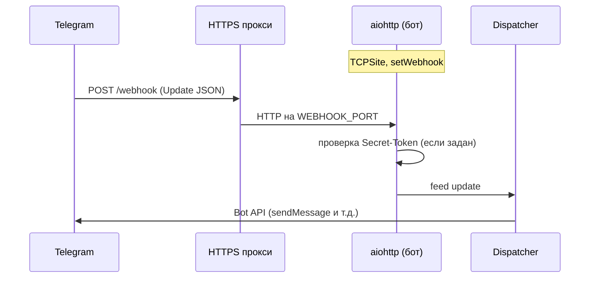
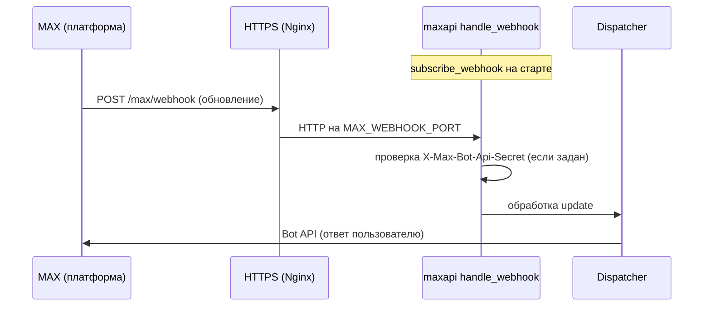

# Legal Consultation Bot

Telegram-бот для записи на юридические консультации. Ведёт пользователя по YAML-сценариям, собирает контакты и создаёт заявку в БД. Опционально - REST API (FastAPI) для CRM и исходящий webhook при новой заявке.

**Продакшен:** для Telegram рекомендуется **`TELEGRAM_USE_WEBHOOK=True`** - входящие обновления по HTTPS webhook (без long polling). Подробный разбор - в [алгоритме webhook](#алгоритм-работы-telegram-webhook).

## Оглавление

- [О проекте](#о-проекте)
- [Возможности](#возможности)
- [Алгоритм работы Telegram webhook](#алгоритм-работы-telegram-webhook)
- [Пошаговая настройка webhook (Telegram и MAX)](#пошаговая-настройка-webhook-telegram-и-max)
  - [Telegram: пошаговая настройка webhook](#telegram-пошаговая-настройка-webhook)
  - [MAX: пошаговая настройка webhook](#max-пошаговая-настройка-webhook)
  - [Чек-лист Telegram webhook](#чек-лист-перед-выкладкой-telegram-webhook)
  - [Чек-лист MAX webhook](#чек-лист-перед-выкладкой-max-webhook)
- [OpenAPI и REST API](#openapi-и-rest-api)
- [Проверка работоспособности (health)](#проверка-работоспособности-health)
- [Безопасность](#безопасность)
- [Быстрый старт](#быстрый-старт)
- [Продакшен: деплой, мониторинг и база данных](#продакшен-деплой-мониторинг-и-база-данных)
- [Медиа-файлы в сценариях](#медиа-файлы-в-сценариях)
- [Конфигурация (.env)](#конфигурация-env)
- [Миграции БД (Alembic)](#миграции-бд-alembic)
- [Бэкапы](#бэкапы)
- [Догоняющие напоминания (Followup)](#догоняющие-напоминания-followup)
- [Линтеры и форматирование](#линтеры-и-форматирование)
- [Тесты](#тесты)
- [Структура проекта](#структура-проекта)
- [CI, SAST и безопасность зависимостей](#ci-sast-и-безопасность-зависимостей)

## О проекте

Точка входа — **`src/main.py`**: инициализация БД, **ConversationManager**, мессенджеры (Telegram, опционально MAX), фоновые задачи (бэкапы, followup). При **`API_ENABLED=True`** в том же процессе поднимается **FastAPI** (интеграционный API на отдельном порту; страницы **Swagger/ReDoc** управляются **`API_DOCS_ENABLED`**, см. [безопасность](#безопасность)). Общие HTTP-проверки **`/health/live`** и **`/health/ready`** на портах webhook Telegram и MAX вынесены в **`src/messengers/webhook_health.py`** (один вызов **`run_ready_checks()`**, различается поле **`service`** в JSON).

Режим **webhook**: внутри процесса бота поднимается **aiohttp**-приложение на `WEBHOOK_LISTEN_HOST` / `WEBHOOK_PORT`; после успешного `setWebhook` Telegram шлёт **POST** с JSON обновления на публичный URL. Режим **long polling** (локально): aiogram опрашивает Telegram без входящего HTTP.

## Возможности

- Telegram-бот (aiogram 3): **webhook (продакшен)** или long polling (локально) + опциональный MAX-мессенджер
- 16 юридических направлений + разветвлённые YAML-сценарии
- **Медиа-вложения** в сценариях: фото, кружочки (video_note), видео, GIF-анимации, стикеры
- Async SQLAlchemy (SQLite для разработки, PostgreSQL для продакшена)
- Alembic-миграции БД
- Автоматические бэкапы БД (local / FTP / S3)
- CI: Ruff + mypy + pytest; отдельные workflow - **CodeQL**, **pip-audit**, **Dependabot**
- Pre-commit хуки
- **Догоняющие напоминания** (followup) - 1ч, 12ч, 24ч, 72ч с авто-завершением
- **Удаление данных** клиентом через `/deletedata`
- **Валидация RU телефонов/email** (+7, 8, стационарные)
- **Возврат клиента** - пропуск контактов при повторном прохождении
- **Python 3.12+**, line-length 80
- **HTTP API** для CRM: заявки и пользователи (FastAPI), **Swagger UI** (`/docs`), **ReDoc** (`/redoc`), схема **OpenAPI 3** (`/openapi.json`)
- **Исходящий webhook** на ваш URL при новой заявке (опционально с Bearer-токеном)
- **Админ-команды** в Telegram и MAX: `/admin`, `/stats`, `/users`, `/export` (`ADMIN_IDS` и `MAX_ADMIN_IDS`)
- **Liveness / readiness** для оркестраторов: на порту API (**`/v1/health/*`**) и на портах webhook (**`/health/*`**, модуль **`webhook_health.py`**)
- **Продакшен** (`docker-compose.prod.yml`): Nginx, **Uptime Kuma** (визуальный мониторинг доступности), health **`/v1/health/*`**, Postgres только на localhost VPS (удалённый просмотр БД через SSH-туннель или опциональный Adminer)

## Алгоритм работы Telegram webhook

Ниже - логика, реализованная в `TelegramMessenger` (`src/messengers/telegram/telegram_messenger.py`) при **`TELEGRAM_USE_WEBHOOK=True`**.

### 1. Предусловия

- Публичный **HTTPS**-URL с валидным сертификатом (для тестов - например ngrok).
- В `.env` / `.env.local` заданы **`WEBHOOK_URL`** (полный или только origin) и при необходимости **`TELEGRAM_WEBHOOK_PATH`** (по умолчанию `/webhook`). Итоговый URL должен совпадать с тем, куда прокси (nginx и т.д.) передаёт POST от Telegram.
- Локальная привязка: **`WEBHOOK_LISTEN_HOST`**, **`WEBHOOK_PORT`**. Разрешённые порты для webhook со стороны Telegram: **443, 80, 88, 8443** ([документация Telegram](https://core.telegram.org/bots/webhooks)).
- Опционально **`TELEGRAM_WEBHOOK_SECRET`**: тот же секрет Telegram передаёт в заголовке `X-Telegram-Bot-Api-Secret-Token` (символы `A–Z`, `a–z`, `0–9`, `_`, `-`).

### 2. Запуск процесса

1. Собирается публичный URL вызовом **`build_telegram_webhook_url()`** (origin + путь, если путь не был в URL).
2. Создаётся **`aiohttp.web.Application`**.
3. Вызывается **`register_aiohttp_webhook_health_routes(app, SERVICE_TELEGRAM_WEBHOOK)`** из **`src/messengers/webhook_health.py`** — маршруты **`GET /health/live`** и **`GET /health/ready`** (см. [health](#проверка-работоспособности-health)).
4. **`SimpleRequestHandler`** (aiogram) вешается на путь webhook (например `/webhook`); при заданном секрете aiogram отклоняет запросы с неверным заголовком.
5. **`setup_application`** связывает приложение с **Dispatcher** и ботом.
6. Запускается **`AppRunner`** + **`TCPSite`** на `WEBHOOK_LISTEN_HOST:WEBHOOK_PORT`.
7. Вызывается **`set_webhook(url=…, secret_token=…, drop_pending_updates=…)`**. При ошибке runner останавливается, исключение пробрасывается.
8. Корутина webhook-режима **блокируется** на `asyncio.Event().wait()` - процесс остаётся живым и обрабатывает HTTP.

### 3. Обработка одного обновления

1. Telegram отправляет **POST** на ваш публичный URL с телом **Update** (JSON).
2. Прокси терминирует TLS и проксирует запрос на локальный порт приложения.
3. aiohttp передаёт запрос в **SimpleRequestHandler** → **Dispatcher** → ваши хендлеры (**ConversationManager** и др.).
4. Исходящие вызовы к Telegram API (ответ пользователю) идут **из вашего сервера** к `api.telegram.org` как обычно.

### 4. Остановка

При **`stop()`**: **`delete_webhook`**, затем **`AppRunner.cleanup()`**. В режиме long polling вместо этого закрывается сессия бота.

### 5. Сводная диаграмма



### 6. Параллельно с REST API

**`API_ENABLED=True`** поднимает FastAPI на **`API_HOST` / `API_PORT`** (отдельный HTTP-сервер). Webhook и API - **разные порты**; nginx может маршрутизировать, например, `/webhook` → webhook-порт, `/v1/` → API-порт.

### Long polling (разработка)

При **`TELEGRAM_USE_WEBHOOK=False`** входящий HTTP для Telegram не нужен; **`start_polling`** запрашивает обновления активно. Для локальной работы без HTTPS это проще.

## Пошаговая настройка webhook (Telegram и MAX)

Ниже — практическая инструкция: что должно работать на сервере, в каком порядке включать режим webhook и как проверить результат. **Telegram** — `src/messengers/telegram/telegram_messenger.py`. **MAX** — `src/messengers/max/max_messenger.py` и `settings.build_max_webhook_url()`.

### Что должно быть на сервере (общее)

| Компонент | Назначение |
|-----------|------------|
| **ОС / контейнер** | Linux (или Docker/Kubernetes) с установленным Python 3.12+ и зависимостями из `requirements.txt` |
| **Приложение бота** | Процесс `python -m src.main` (или образ из `Dockerfile` / `docker compose`) |
| **Сеть** | Исходящий доступ к API мессенджера (Telegram: `api.telegram.org`; MAX: хосты из документации [dev.max.ru](https://dev.max.ru)) |
| **Входящий HTTPS** | Публичный URL с **валидным TLS** (Let's Encrypt и т.п.) — обязателен для **Telegram Bot API webhook**; для MAX при переходе на webhook — по правилам платформы |
| **Reverse proxy (желательно)** | **Nginx**, Caddy, Traefik: терминация TLS, проксирование на локальный порт процесса бота, ограничение rate, логи |
| **Порты** | Telegram: внешний URL должен указывать на один из портов **443, 80, 88, 8443** ([требование Bot API](https://core.telegram.org/bots/webhooks)). Внутри машины процесс слушает `WEBHOOK_PORT` (часто `8443`) за reverse proxy. **MAX:** локальный сервер maxapi слушает **`MAX_WEBHOOK_PORT`** (по умолчанию **8444**), чтобы не пересечься с Telegram в одном процессе |

Схема в продакшене: **Интернет → HTTPS (443) → Nginx → HTTP на `127.0.0.1:порт` → aiohttp (Telegram и/или MAX webhook)**.

---

### Telegram: пошаговая настройка webhook

Реализовано при **`TELEGRAM_USE_WEBHOOK=True`**: поднимается **aiohttp**, регистрируется путь **`TELEGRAM_WEBHOOK_PATH`** (по умолчанию `/webhook`), вызывается **`setWebhook`**.

#### Шаг 1. Домен и DNS

1. Зарегистрируйте поддомен, например `bot.example.com`.
2. В DNS создайте запись **A** (или **AAAA** для IPv6) на публичный IP вашего сервера.
3. Дождитесь распространения DNS (`dig bot.example.com`).

#### Шаг 2. TLS (SSL)

На сервере с Nginx проще всего **Certbot** (Let's Encrypt):

- Установите certbot и плагин для nginx, получите сертификат на `bot.example.com`.
- Автообновление сертификата (cron/systemd timer) обязательно для стабильной работы webhook.

Без валидного HTTPS Telegram **не будет** доставлять обновления на ваш URL.

#### Шаг 3. Reverse proxy (пример Nginx)

Приложение слушает **`WEBHOOK_LISTEN_HOST` / `WEBHOOK_PORT`** (часто `0.0.0.0:8443`). Nginx принимает HTTPS и проксирует на приложение.

Пример фрагмента (пути и порты подставьте свои):

```nginx
server {
    listen 443 ssl;
    server_name bot.example.com;
    ssl_certificate     /etc/letsencrypt/live/bot.example.com/fullchain.pem;
    ssl_certificate_key /etc/letsencrypt/live/bot.example.com/privkey.pem;

    location /webhook {
        proxy_pass http://127.0.0.1:8443;
        proxy_http_version 1.1;
        proxy_set_header Host $host;
        proxy_set_header X-Real-IP $remote_addr;
        proxy_set_header X-Forwarded-For $proxy_add_x_forwarded_for;
        proxy_set_header X-Forwarded-Proto $scheme;
    }

    # Опционально: те же location для health (если бот слушает тот же порт WEBHOOK_PORT)
    location /health/ {
        proxy_pass http://127.0.0.1:8443;
        proxy_http_version 1.1;
        proxy_set_header Host $host;
        proxy_set_header X-Forwarded-Proto $scheme;
    }
}
```

Важно: **внешний** URL, который вы укажете в `WEBHOOK_URL`, должен совпадать с тем, куда Telegram шлёт POST (включая путь `/webhook`).

#### Шаг 4. Переменные окружения

В `.env` или `.env.local`:

```env
TELEGRAM_BOT_TOKEN=ВАШ_ТОКЕН_ОТ_BOTFATHER
TELEGRAM_USE_WEBHOOK=True

# Публичный URL, который видит Telegram (через HTTPS)
WEBHOOK_URL=https://bot.example.com/webhook

# Где слушает процесс бота (за nginx)
WEBHOOK_LISTEN_HOST=0.0.0.0
WEBHOOK_PORT=8443

# Если в WEBHOOK_URL уже полный путь — TELEGRAM_WEBHOOK_PATH можно не трогать;
# если задан только origin https://bot.example.com — путь допишется из TELEGRAM_WEBHOOK_PATH
TELEGRAM_WEBHOOK_PATH=/webhook

# Рекомендуется: секрет в заголовке X-Telegram-Bot-Api-Secret-Token (символы A-Z a-z 0-9 _ -)
TELEGRAM_WEBHOOK_SECRET=случайная_строка

TELEGRAM_WEBHOOK_DROP_PENDING=False
```

Логика сборки URL описана в `settings.build_telegram_webhook_url()`: если в `WEBHOOK_URL` уже есть путь (не только `/`), он используется как есть.

#### Шаг 5. Запуск приложения

```bash
# пример: venv уже активирован
python -m src.main
```

В логах должны появиться строки про запуск Telegram webhook, публичный URL и порт health. При ошибке `setWebhook` процесс завершится с исключением — проверьте токен, URL и доступность HTTPS снаружи.

#### Шаг 6. Проверка

1. **Health** (если API выключен, см. раздел [Проверка работоспособности](#проверка-работоспособности-health)):  
   `GET https://bot.example.com/health/live` (через тот же nginx, если вы проксируете и эти пути) — либо напрямую на порт приложения, если health проброшен отдельно.
2. **Telegram API** — статус webhook:

```bash
curl -s "https://api.telegram.org/bot<TELEGRAM_BOT_TOKEN>/getWebhookInfo"
```

В ответе должны быть `url` с вашим HTTPS-адресом, `last_error_date` желательно пустой/старый.

3. Напишите боту в Telegram — ответ должен приходить без задержек очереди long polling.

#### Шаг 7. Остановка и смена режима

При корректном завершении процесса вызывается **`delete_webhook`**. Чтобы снова перейти на long polling, установите **`TELEGRAM_USE_WEBHOOK=False`** и перезапустите процесс.

#### Параллельно: REST API

Если **`API_ENABLED=True`**, FastAPI слушает **`API_HOST` / `API_PORT`** (часто `8080`) — это **отдельный** HTTP-сервер. Nginx может разводить маршруты: например `/webhook` → бот, `/v1/` → API. Подробнее — в разделе [OpenAPI и REST API](#openapi-и-rest-api).

---

### MAX: пошаговая настройка webhook

Реализовано при **`MAX_USE_WEBHOOK=True`** в **`MaxMessenger.start()`**:

1. **`bot.subscribe_webhook(url, update_types, secret)`** — регистрация публичного HTTPS-адреса в API MAX ([документация платформы](https://dev.max.ru)).
2. **`dispatcher.handle_webhook(...)`** — локальный **aiohttp**-сервер на **`MAX_WEBHOOK_LISTEN_HOST`:`MAX_WEBHOOK_PORT`**, путь **`MAX_WEBHOOK_PATH`**; входящие POST с обновлениями обрабатывает maxapi.
3. Секрет **`MAX_WEBHOOK_SECRET`** передаётся и в подписку, и в обработчик; проверка заголовка **`X-Max-Bot-Api-Secret`** (см. исходники maxapi).
4. Подписываются типы: **`message_created`**, **`message_callback`**, **`bot_started`** (соответствует хендлерам в коде).
5. При **`stop()`** вызывается **`bot.delete_webhook()`** (снимает подписки через API MAX).

При **`MAX_USE_WEBHOOK=False`** используется **`start_polling`** — входящий HTTP на сервере **не нужен** (удобно для локальной разработки).

#### Шаг 1. Домен и DNS

Используйте тот же хост, что и для Telegram (например `bot.example.com`), или отдельный поддомен (`max-bot.example.com`). Запись **A** / **AAAA** должна указывать на IP сервера с ботом.

#### Шаг 2. TLS (SSL)

Требуется **валидный HTTPS** на том хосте и пути, которые вы укажете в **`MAX_WEBHOOK_URL`** (обычно Let's Encrypt + Nginx). Без HTTPS платформа не сможет надёжно доставлять webhook на ваш URL.

#### Шаг 3. Reverse proxy (Nginx)

Процесс бота слушает **отдельный** порт **`MAX_WEBHOOK_PORT`** (по умолчанию **8444**), чтобы не конфликтовать с Telegram webhook на **`WEBHOOK_PORT`** (часто **8443**), если оба бота включены в одном процессе.

Пример одного `server` с **двумя** `location`: Telegram и MAX (подставьте свои порты и пути):

```nginx
server {
    listen 443 ssl;
    server_name bot.example.com;
    ssl_certificate     /etc/letsencrypt/live/bot.example.com/fullchain.pem;
    ssl_certificate_key /etc/letsencrypt/live/bot.example.com/privkey.pem;

    # Telegram Bot API webhook (aiogram)
    location /webhook {
        proxy_pass http://127.0.0.1:8443;
        proxy_http_version 1.1;
        proxy_set_header Host $host;
        proxy_set_header X-Real-IP $remote_addr;
        proxy_set_header X-Forwarded-For $proxy_add_x_forwarded_for;
        proxy_set_header X-Forwarded-Proto $scheme;
    }

    # MAX Messenger webhook (maxapi)
    location /max/webhook {
        proxy_pass http://127.0.0.1:8444;
        proxy_http_version 1.1;
        proxy_set_header Host $host;
        proxy_set_header X-Real-IP $remote_addr;
        proxy_set_header X-Forwarded-For $proxy_add_x_forwarded_for;
        proxy_set_header X-Forwarded-Proto $scheme;
        # Если задан MAX_WEBHOOK_SECRET — платформа шлёт секрет; прокси не должен вырезать заголовки
        proxy_pass_request_headers on;
    }
}
```

Итоговый **публичный** URL для MAX должен совпадать с тем, что попадёт в **`subscribe_webhook`**, например **`https://bot.example.com/max/webhook`**. Логика сборки URL — **`settings.build_max_webhook_url()`**: если в **`MAX_WEBHOOK_URL`** указан только origin без пути (`https://bot.example.com`), к нему дописывается **`MAX_WEBHOOK_PATH`** (`/max/webhook`).

#### Шаг 4. Переменные окружения

В `.env` или `.env.local`:

```env
MAX_BOT_TOKEN=токен_бота_MAX
MAX_USE_WEBHOOK=True

# Публичный HTTPS URL, который зарегистрируется в MAX (см. build_max_webhook_url)
MAX_WEBHOOK_URL=https://bot.example.com/max/webhook
# Либо только origin — тогда путь возьмётся из MAX_WEBHOOK_PATH:
# MAX_WEBHOOK_URL=https://bot.example.com
# MAX_WEBHOOK_PATH=/max/webhook

MAX_WEBHOOK_PATH=/max/webhook
MAX_WEBHOOK_SECRET=длинная_случайная_строка

MAX_WEBHOOK_LISTEN_HOST=0.0.0.0
MAX_WEBHOOK_PORT=8444
```

**Важно:** **`MAX_WEBHOOK_SECRET`** в продакшене задавайте и синхронизируйте с тем, что ожидает проверка в maxapi; иначе запросы с платформы могут отклоняться.

#### Шаг 5. Запуск приложения

```bash
python -m src.main
```

В логах ожидайте строки вида: **`MAX bot enabled (webhook)`**, **`MAX webhook: public URL=...`**, **`listen http://0.0.0.0:8444/max/webhook`** (значения зависят от конфига). Если **`MAX_WEBHOOK_URL`** пуст при **`MAX_USE_WEBHOOK=True`**, процесс завершится с **`RuntimeError`**.

#### Шаг 6. Проверка

1. **Снаружи** откройте в браузере или через `curl` базовый HTTPS сайта — убедитесь, что сертификат валиден.
2. **Логи** — нет ли исключений сразу после `subscribe_webhook`.
3. **Функционально** — напишите боту в MAX: должны приходить ответы без режима long polling.
4. При необходимости смотрите подписки в API MAX (методы вроде получения списка подписок — см. [dev.max.ru](https://dev.max.ru)) — в вашей версии maxapi это может делать **`get_subscriptions`** внутри **`delete_webhook`**.

На **`MAX_WEBHOOK_PORT`** (режим webhook) доступны те же **`GET /health/live`** и **`GET /health/ready`**, что и у Telegram: ответ **`/health/ready`** строится через **`run_ready_checks()`** (БД, бэкапы). В JSON есть поле **`service`: `"max_webhook"`**. Если на одном домене с Telegram нужен Nginx без конфликта путей, см. пример **`/max/health/live`** в `deploy/nginx/conf.d/law-bot.conf.example` или используйте единый **`GET /v1/health/ready`** на порту API.

#### Шаг 7. Остановка и смена режима

При штатной остановке процесса вызывается **`delete_webhook`** для MAX. Чтобы снова перейти на **long polling**, установите **`MAX_USE_WEBHOOK=False`** и перезапустите процесс.

#### Оба мессенджера (Telegram + MAX) в webhook

| Сервис | Переменная порта | Пример пути | Backend в Nginx |
|--------|------------------|---------------|-----------------|
| Telegram | `WEBHOOK_PORT` | `TELEGRAM_WEBHOOK_PATH` (`/webhook`) | `127.0.0.1:8443` |
| MAX | `MAX_WEBHOOK_PORT` | `MAX_WEBHOOK_PATH` (`/max/webhook`) | `127.0.0.1:8444` |

Один процесс **`python -m src.main`** поднимает **два** asyncio-задачи (по одному на мессенджер), каждая со своим aiohttp-сервером webhook — порты не должны совпадать.

#### Схема потока (MAX)



#### Краткое сравнение Telegram и MAX

| Аспект | Telegram (в проекте) | MAX (в проекте) |
|--------|----------------------|-----------------|
| Входящие обновления | Webhook (aiogram + `setWebhook`) или long polling | Webhook (`subscribe_webhook` + `handle_webhook`) или long polling |
| Настройка в `.env` | `TELEGRAM_USE_WEBHOOK`, `WEBHOOK_URL`, … | `MAX_USE_WEBHOOK`, `MAX_WEBHOOK_URL`, `MAX_WEBHOOK_PATH`, порты, секрет |
| Секрет | `X-Telegram-Bot-Api-Secret-Token` | `X-Max-Bot-Api-Secret` |
| Health на порту webhook | `/health/live`, `/health/ready` | `/health/live`, `/health/ready` (тот же `run_ready_checks`) |

---

### Чек-лист перед выкладкой Telegram webhook

- [ ] DNS указывает на сервер, HTTPS открывается из браузера без предупреждений
- [ ] Nginx (или аналог) проксирует путь webhook на `WEBHOOK_PORT`
- [ ] В `.env` заданы `TELEGRAM_USE_WEBHOOK=True`, `WEBHOOK_URL`, токен бота
- [ ] `getWebhookInfo` показывает правильный `url`
- [ ] Пробы Kubernetes/Docker настроены на `/health/live` и `/health/ready` (см. [health](#проверка-работоспособности-health))

### Чек-лист перед выкладкой MAX webhook

- [ ] **`MAX_WEBHOOK_URL`** — полный публичный HTTPS-адрес, совпадающий с `location` в Nginx (путь + origin)
- [ ] **`MAX_WEBHOOK_PORT`** не совпадает с **`WEBHOOK_PORT`**, если в одном процессе включены Telegram и MAX webhook
- [ ] Nginx проксирует **`MAX_WEBHOOK_PATH`** на `127.0.0.1:MAX_WEBHOOK_PORT` с заголовками `Host`, `X-Forwarded-Proto`
- [ ] Заданы **`MAX_BOT_TOKEN`**, **`MAX_USE_WEBHOOK=True`**, при необходимости **`MAX_WEBHOOK_SECRET`**
- [ ] После старта в логах есть строка про **`MAX webhook`** и listen; тест в клиенте MAX успешен
- [ ] При смене URL или отключении webhook процесс останавливается штатно (вызывается отписка через **`delete_webhook`**)

## OpenAPI и REST API

**OpenAPI 3** - машиночитаемое описание HTTP API (пути, параметры, схемы JSON, коды ответов). По нему строятся **Swagger UI** и **ReDoc**, генерируются клиенты и тесты. В проекте схема отдаётся как **`GET /openapi.json`**; описание для человека дублируется в **`src/api/openapi_config.py`**.

### Интерактивная документация

После включения API (`API_ENABLED=True` или `python -m src.run_api`) страницы **`/docs`**, **`/redoc`** и **`/openapi.json`** доступны, если **`API_DOCS_ENABLED=True`**, либо по умолчанию при **`DEBUG=True`** (иначе в продакшене документация скрыта — см. [безопасность](#безопасность)).

| URL | Описание |
|-----|----------|
| `http://<хост>:<порт>/docs` | **Swagger UI** — методы, схемы, **Authorize** |
| `http://<хост>:<порт>/redoc` | **ReDoc** |
| `http://<хост>:<порт>/openapi.json` | Спецификация OpenAPI 3 |

Корень **`GET /`** возвращает JSON с путями **health**; блок **`documentation`** с ссылками на Swagger/ReDoc добавляется только при включённой документации.

### Запуск

1. Зависимости: `fastapi`, `uvicorn` (в `requirements.txt`).
2. В `.env` / `.env.local`: **`API_ENABLED=True`**, при необходимости **`API_PORT`**, **`INTEGRATION_API_TOKEN`**.
3. **Бот + API:** `python -m src.main`.
4. **Только API:** `python -m src.run_api`.

### Авторизация

- Если **`INTEGRATION_API_TOKEN` задан** - заголовок **`Authorization: Bearer <токен>`** или **`X-API-Key: <токен>`**. В Swagger: **Authorize** → Bearer или ApiKey.
- Если токен пустой - проверка отключена (только изолированная сеть).

### Методы API

| Метод | Путь | Назначение |
|-------|------|------------|
| GET | `/v1/health` | Liveness (совместимость с прежним health, без БД) |
| GET | `/v1/health/live` | Liveness, без БД |
| GET | `/v1/health/ready` | Readiness: БД + бэкапы (если **`BACKUP_ENABLED`**); **503** при сбое |
| GET | `/v1/consultations/{id}` | Одна заявка и пользователь по id |
| GET | `/v1/consultations` | Поиск: query `phone`, `email`, `status` (нужен минимум один параметр; фильтры AND) |
| POST | `/v1/consultations/{id}/push` | Повторно отправить JSON заявки на `OUTBOUND_WEBHOOK_URL` |

Пример с токеном:

```bash
curl -s -H "Authorization: Bearer ВАШ_ТОКЕН" \
  "http://127.0.0.1:8080/v1/consultations?status=pending&limit=10"
```

### Исходящий webhook (бот → ваш сервер)

При завершении диалога с новой заявкой выполняется **POST** на **`OUTBOUND_WEBHOOK_URL`** (тело: `event`, `consultation`, `user`). Если задан **`OUTBOUND_WEBHOOK_TOKEN`**, добавляется **`Authorization: Bearer ...`**. Детали полей - в `/docs` и в `src/services/outbound_sync.py`.

## Проверка работоспособности (health)

Используются два уровня:

| Тип | Назначение | Что проверяется |
|-----|------------|-----------------|
| **Liveness** | Процесс и HTTP-стек отвечают | не проверяется |
| **Readiness** | Готовность принимать нагрузку | БД (`SELECT 1`); при **`BACKUP_ENABLED=True`** также цепочка бэкапов |

### Когда включён REST API (`API_ENABLED=True` или только `run_api`)

| Метод | Путь | Код при неготовности |
|-------|------|----------------------|
| GET | `/v1/health` | всегда 200 (liveness) |
| GET | `/v1/health/live` | всегда 200 |
| GET | `/v1/health/ready` | **503**, если БД недоступна **или** проверка бэкапов не прошла (см. ниже) |

Ответ **`GET /v1/health/ready`** (JSON): поле **`checks`** — как минимум **`database`** и **`backup`**. Для **`backup`**: `disabled` (бэкапы выключены), `ok` / `ok: awaiting first backup…`, либо `fail: …` (нет доступа к каталогу, файл слишком старый при локальном хранилище, пустой конфиг FTP/S3). Для **FTP** и **S3** в health проверяется только заполненность настроек, не сетевое соединение — при сбоях выгрузки смотрите логи **`BackupService`**.

**Локальное хранилище:** «слишком старый» бэкап — если возраст самого нового файла `legal_bot_*.sql.gz` превышает **`max(2 суток, 3 × BACKUP_INTERVAL_HOURS)`** (тогда readiness даёт **503**).

### Режим только webhook (API выключен)

На портах webhook те же маршруты, что регистрирует **`webhook_health.py`**:

| Порт (по умолчанию) | Мессенджер | Поле `service` в JSON |
|---------------------|------------|------------------------|
| **`WEBHOOK_PORT`** (8443) | Telegram | `telegram_webhook` |
| **`MAX_WEBHOOK_PORT`** (8444) | MAX | `max_webhook` |

| Метод | Путь |
|-------|------|
| GET | `/health/live` |
| GET | `/health/ready` |

Ответ **`/health/ready`** совпадает по смыслу с **`GET /v1/health/ready`** (поля **`status`**, **`ready`**, **`checks`**, **`version`**) плюс **`service`**. Если включены оба мессенджера в webhook, на каждом порту свои **`/health/*`**; при доступе через один Nginx для MAX используйте префикс **`/max/health/...`** (см. **`deploy/nginx/conf.d/law-bot.conf.example`**).

### Примеры для Kubernetes

```yaml
livenessProbe:
  httpGet:
    path: /v1/health/live
    port: 8080
  initialDelaySeconds: 10
  periodSeconds: 15
readinessProbe:
  httpGet:
    path: /v1/health/ready
    port: 8080
  initialDelaySeconds: 5
  periodSeconds: 10
```

Если в поде только бот с webhook и без API, замените **port** на порт webhook и пути на **`/health/live`** и **`/health/ready`**.

## Безопасность

### Конфигурация и секреты

- Файлы **`.env`** и **`.env.local`** в **`.gitignore`** — не коммитьте токены и пароли БД.
- **`INTEGRATION_API_TOKEN`**: при пустом значении интеграционное API принимает запросы **без авторизации** (удобно только в локальной сети). Для любого доступа из интернета задайте длинный случайный токен; при старте в лог пишется предупреждение, если токен пустой.
- **`API_DOCS_ENABLED`**: по умолчанию совпадает с **`DEBUG`** — в продакшене при **`DEBUG=False`** страницы **`/docs`**, **`/redoc`** и **`/openapi.json`** **скрыты**, пока вы явно не зададите **`API_DOCS_ENABLED=True`** (снижает разведку API).

### HTTP API

- Проверка токена интеграции выполняется через **`hmac.compare_digest`** (устойчивее к timing-атакам, чем простое сравнение строк).
- К ответам API добавляются заголовки **`X-Content-Type-Options: nosniff`**, **`X-Frame-Options: DENY`**, **`Referrer-Policy`**.

### Исходящий webhook заявок

- Для **`OUTBOUND_WEBHOOK_URL`** по умолчанию действует проверка на типичные **SSRF**-цели: localhost, link-local, частные диапазоны, метаданные облака (`169.254.169.254`). Для вызова внутренних URL в доверенной сети можно задать **`OUTBOUND_WEBHOOK_ALLOW_PRIVATE_IPS=True`** (см. `src/security/url_validation.py`). Полная защита от SSRF по разрешённому DNS в открытый интернет не гарантируется — указывайте только доверенные URL.

### Сценарии (YAML)

- Загрузка алгоритмов ограничена именами **`[a-z0-9_]{1,64}`** и каталогом **`src/scenarios/algorithms/`** (защита от path traversal при подборе направления).

### Рекомендации для продакшена

- Закрывайте интеграционное API на уровне **Nginx** (TLS, ограничение IP, Basic Auth) в дополнение к токену.
- Регулярно обновляйте зависимости (**Dependabot**, **`pip-audit`** в CI).

## Быстрый старт

### 1. Установка через Poetry (рекомендуется)

```bash
# Клонировать проект
git clone <repo-url> && cd legal_bot_app

# Установить зависимости
poetry install

# Скопировать конфиг
cp env.example .env.local

# Вписать токен бота (получить у @BotFather)
# В файле .env.local:
#   TELEGRAM_BOT_TOKEN=7123456789:AAxxxxxxxxxxxxxxxxxxxxxxx

# Запустить бота
poetry run python -m src.main

# Только HTTP API (без Telegram): нужны fastapi + uvicorn из requirements.txt
# poetry run python -m src.run_api
```

### 2. Установка через pip

```bash
python -m venv .venv
source .venv/bin/activate   # Linux/Mac
# .venv\Scripts\activate    # Windows

pip install -r requirements.txt
cp env.example .env.local
# Заполнить TELEGRAM_BOT_TOKEN в .env.local

# Опционально — полный набор для разработки (ruff, mypy, pytest, pre-commit), см. requirements-dev.txt
# pip install -r requirements-dev.txt

python -m src.main

# Только интеграционный API (Swagger: http://localhost:8080/docs)
# python -m src.run_api
```

### 3. Запуск через Docker

```bash
# Скопировать конфиг
cp env.example .env.local
# Заполнить TELEGRAM_BOT_TOKEN в .env.local

# Собрать и запустить (бот + PostgreSQL)
docker compose up --build -d

# Посмотреть логи
docker compose logs -f bot

# Остановить
docker compose down
```

Docker Compose поднимает:

- **postgres** - PostgreSQL 15 (данные в Docker volume)
- **bot** - приложение (автоматически подключается к postgres)

При старте контейнера бота выполняется **`alembic upgrade head`** (см. `scripts/docker-entrypoint.sh`).

Подробности по выкладке на сервер — в разделе [Продакшен](#продакшен-деплой-мониторинг-и-база-данных) и в [docs/DEPLOYMENT.md](docs/DEPLOYMENT.md).

## Продакшен: деплой, мониторинг и база данных

Краткая схема соответствует **`docker-compose.prod.yml`** (PostgreSQL, контейнер бота, Nginx, **Uptime Kuma**). Полная пошаговая инструкция, TLS и CI/CD — в **[docs/DEPLOYMENT.md](docs/DEPLOYMENT.md)**.

### Стек и файлы

| Компонент | Файл / сервис |
|-----------|----------------|
| Образ приложения | `Dockerfile`, переменная **`BOT_IMAGE_REF`** при деплое из GHCR |
| Compose продакшена | `docker-compose.prod.yml` |
| Reverse proxy и TLS | `deploy/nginx/conf.d/` (шаблон: `law-bot.conf.example` — webhook Telegram/MAX, API, **`/max/health/*`**) |
| Health webhook (общий код) | `src/messengers/webhook_health.py` |
| Миграции при старте | `scripts/docker-entrypoint.sh` (`alembic upgrade head`) |
| CI: образ + опционально SSH | `.github/workflows/release-deploy.yml` (ветка **`release`**) |

Запуск стека на VPS (после настройки `.env`, Nginx и SSL):

```bash
docker compose -f docker-compose.prod.yml up -d --build
```

Опционально веб-UI для БД (Adminer):  
`docker compose -f docker-compose.prod.yml --profile db-ui up -d`

### Мониторинг (обязателен на проде)

1. **HTTP health** через Nginx: **`GET /v1/health/live`** и **`GET /v1/health/ready`**. Второй отражает **БД** и при **`BACKUP_ENABLED=True`** — **бэкапы** (поле **`checks.backup`** в JSON); **503** при любой ошибке проверки. В продакшен-compose по умолчанию **`API_ENABLED=true`**, иначе эти пути недоступны на отдельном порту API.
2. **Uptime Kuma** — отдельный контейнер в **`docker-compose.prod.yml`**, слушает **`127.0.0.1:3001`** на VPS (порт **`UPTIME_KUMA_PORT`**). Дашборды и алерты на доступность бота и цепочки TLS → Nginx → приложение.
3. В Kuma имеет смысл добавить минимум два монитора на **`/v1/health/ready`** (внутренний **`http://bot:8080/...`** и внешний **`https://<домен>/...`**) — так отслеживаются и база, и (при включённых бэкапах) актуальность резервных копий.

Доступ к веб-интерфейсу Kuma с вашего компьютера: **SSH-туннель** `ssh -L 3001:127.0.0.1:3001 user@<VPS>` и браузер на **`http://127.0.0.1:3001`**.

### Удалённый просмотр PostgreSQL

- **Рекомендуется:** клиент (DBeaver, DataGrip, pgAdmin) + **SSH-туннель** к порту Postgres на VPS. В compose Postgres проброшен на **`127.0.0.1:${POSTGRES_HOST_PORT:-5432}`** только на localhost сервера (не в интернет).
- **Опционально:** веб-**Adminer** — профиль **`db-ui`**:  
  `docker compose -f docker-compose.prod.yml --profile db-ui up -d`  
  затем **`http://127.0.0.1:8888`** на сервере (**`ADMINER_HOST_PORT`**) или тот же туннель `ssh -L 8888:127.0.0.1:8888 …`.

Учётные данные БД — **`DB_USER`**, **`DB_PASSWORD`**, **`DB_NAME`** в `.env` на сервере.

### Безопасность

- Задайте **`INTEGRATION_API_TOKEN`** и ограничьте снаружи доступ к **`/v1/`** (Nginx: IP или Basic Auth), если API не должно быть публичным.
- Не публикуйте Postgres, Kuma и Adminer на **`0.0.0.0`** без необходимости; для удалённого доступа используйте VPN или SSH.

## Медиа-файлы в сценариях

Медиа хранятся в `src/scenarios/media/`. Поддерживаются:

| Тип | Ключ | Расширения | Описание |
|---|---|---|---|
| Фотографии | `photo` | jpg, png, webp | Обычное фото с подписью |
| Кружочки | `video_note` | mp4 | Круглое видео (Telegram video note) |
| Видео | `video` | mp4, mov | Обычное видео с подписью |
| GIF | `animation` | gif, mp4 | Анимация |
| Стикеры | `sticker` | webp, tgs | Стикеры |

### Пример YAML-сценария с медиа

```yaml
steps:
  - id: "greeting"
    type: "text"
    content: "Добро пожаловать!"
    media:
      - type: "photo"
        file: "src/scenarios/media/welcome.jpg"
        caption: "Наша команда юристов"
      - type: "video_note"
        file: "src/scenarios/media/greeting_circle.mp4"
```

Каждый шаг может содержать несколько медиа-вложений. Они отправляются перед текстом шага.

Legacy-поле `photo` (на уровне шага) по-прежнему поддерживается для обратной совместимости.

## Конфигурация (.env)

Приложение загружает `.env`, затем `.env.local` с приоритетом. Для локальной разработки используйте `.env.local` (он в `.gitignore`).

| Переменная | По умолчанию | Описание |
|---|---|---|
| `TELEGRAM_BOT_TOKEN` | - | Токен от @BotFather |
| `TELEGRAM_USE_WEBHOOK` | `False` | `True` - только webhook (продакшен) |
| `WEBHOOK_URL` | - | Публичный `https://…` для `setWebhook` |
| `WEBHOOK_LISTEN_HOST` | `0.0.0.0` | Привязка локального HTTP под webhook |
| `WEBHOOK_PORT` | `8443` | Порт (из разрешённых Telegram: 443, 80, 88, 8443) |
| `TELEGRAM_WEBHOOK_PATH` | `/webhook` | Путь, если в `WEBHOOK_URL` нет пути |
| `TELEGRAM_WEBHOOK_SECRET` | - | Секрет заголовка от Telegram (рекомендуется) |
| `TELEGRAM_WEBHOOK_DROP_PENDING` | `False` | Сбрасывать очередь updates при set/delete webhook |
| `MAX_BOT_TOKEN` | - | Токен MAX (опционально) |
| `MAX_USE_WEBHOOK` | `False` | `True` — webhook через maxapi (`subscribe_webhook` + `handle_webhook`) |
| `MAX_WEBHOOK_URL` | - | Публичный `https://…` для `subscribe_webhook` |
| `MAX_WEBHOOK_PATH` | `/max/webhook` | Путь локального HTTP и суффикс URL, если в `MAX_WEBHOOK_URL` нет пути |
| `MAX_WEBHOOK_SECRET` | - | Секрет заголовка `X-Max-Bot-Api-Secret` |
| `MAX_WEBHOOK_LISTEN_HOST` | как `WEBHOOK_LISTEN_HOST` | Привязка HTTP-сервера MAX webhook |
| `MAX_WEBHOOK_PORT` | `8444` | Порт MAX webhook (отдельно от `WEBHOOK_PORT` у Telegram) |
| `DATABASE_URL` | `sqlite+aiosqlite:///./legal_bot.db` | URL базы данных |
| `DEBUG` | `False` | Режим отладки |
| `LOG_LEVEL` | `INFO` | Уровень логирования |
| `BACKUP_ENABLED` | `False` | Включить авто-бэкапы |
| `BACKUP_STORAGE_TYPE` | `local` | `local` / `ftp` / `s3` |
| `BACKUP_INTERVAL_HOURS` | `1` | Интервал бэкапов (часы) |
| `BACKUP_RETENTION_DAYS` | `30` | Хранить бэкапы (дни) |
| `FOLLOWUP_ENABLED` | `False` | Включить догоняющие напоминания |
| `FOLLOWUP_CHECK_INTERVAL_MIN` | `10` | Как часто проверять (минуты) |
| `FOLLOWUP_INTERVALS_HOURS` | `[1, 12, 24, 72]` | Через сколько часов напоминать (JSON) |
| `FOLLOWUP_MESSAGES` | встроенные | Тексты напоминаний (JSON-массив строк) |
| `ADMIN_IDS` | - | Telegram user id админов через запятую |
| `MAX_ADMIN_IDS` | - | MAX user id админов через запятую (те же админ-команды) |
| `API_ENABLED` | `False` | Поднять REST API вместе с ботом (`src.main`) |
| `API_HOST` | `0.0.0.0` | Адрес прослушивания API |
| `API_PORT` | `8080` | Порт API |
| `API_DOCS_ENABLED` | как `DEBUG` | Swagger/ReDoc/OpenAPI; в проде без `True` — скрыто |
| `INTEGRATION_API_TOKEN` | - | Токен для внешних запросов (пусто = без проверки) |
| `OUTBOUND_WEBHOOK_URL` | - | URL для POST при новой заявке |
| `OUTBOUND_WEBHOOK_TOKEN` | - | Bearer к внешнему webhook (можно пусто) |
| `OUTBOUND_WEBHOOK_ALLOW_PRIVATE_IPS` | `False` | Разрешить localhost/частные IP в исходящем URL (только доверенная сеть) |

Полный список переменных: `env.example`

## Миграции БД (Alembic)

Миграции читают `DATABASE_URL` из `.env` / `.env.local`.

```bash
# Применить все миграции
alembic upgrade head

# Создать новую миграцию после изменения моделей
alembic revision --autogenerate -m "описание изменений"

# Откатить на одну миграцию назад
alembic downgrade -1

# Посмотреть текущую ревизию
alembic current

# История миграций
alembic history
```

### Миграции в Docker

При обычном `docker compose up` миграции применяются при старте контейнера. Ручной запуск:

```bash
docker compose exec bot alembic upgrade head
docker compose exec bot alembic revision --autogenerate -m "add new field"
```

## Бэкапы

Настраиваются в `.env`. Поддерживаются три типа хранилищ.

### Контроль работоспособности

- При **`BACKUP_ENABLED=True`** результат проверки попадает в **`GET /v1/health/ready`** (и **`GET /health/ready`** на webhook-порту Telegram) в **`checks.backup`**.
- **Локально:** каталог **`BACKUP_LOCAL_PATH`** должен быть доступен на запись; свежесть последнего файла — см. [Readiness](#проверка-работоспособности-health) (порог возраста файла).
- **FTP / S3:** в health проверяется только наличие обязательных полей конфигурации; реальную доставку смотрите по логам и по наличию файлов на стороне сервера/бакета.

### Локальный

```env
BACKUP_ENABLED=True
BACKUP_STORAGE_TYPE=local
BACKUP_LOCAL_PATH=./backups
```

### FTP / FTPS

```env
BACKUP_STORAGE_TYPE=ftp
BACKUP_FTP_HOST=ftp.example.com
BACKUP_FTP_PORT=21
BACKUP_FTP_USER=user
BACKUP_FTP_PASSWORD=secret
BACKUP_FTP_PATH=/backups
BACKUP_FTP_TLS=True
```

### S3 (AWS / MinIO / Yandex Object Storage)

```bash
pip install boto3  # дополнительная зависимость
```

```env
BACKUP_STORAGE_TYPE=s3
BACKUP_S3_ENDPOINT=https://storage.yandexcloud.net
BACKUP_S3_BUCKET=my-backups
BACKUP_S3_ACCESS_KEY=...
BACKUP_S3_SECRET_KEY=...
BACKUP_S3_REGION=ru-central1
BACKUP_S3_PREFIX=backups
```

## Догоняющие напоминания (Followup)

Фоновый сервис периодически проверяет неактивные чаты и отправляет напоминания клиентам, которые не завершили консультацию:

| Интервал | Действие |
|---|---|
| 1 час | Первое напоминание |
| 12 часов | Второе напоминание |
| 24 часа | Третье напоминание |
| 72 часа (3 дня) | Последнее напоминание |
| > 72 часов | Чат автоматически завершается |

Интервалы и тексты настраиваются через `.env`:

```env
FOLLOWUP_ENABLED=True
FOLLOWUP_CHECK_INTERVAL_MIN=10
FOLLOWUP_INTERVALS_HOURS=[1, 12, 24, 72]
# FOLLOWUP_MESSAGES=["Текст 1","Текст 2","Текст 3","Текст 4"]
```

### Возврат завершённого клиента

Если клиент, который ранее завершил консультацию, снова пишет `/start`, бот проводит его по сценарию заново, но **пропускает этап сбора контактов** (имя, телефон уже есть в БД).

### Удаление данных

Команда `/deletedata` запускает процедуру удаления персональных данных:

1. Бот запрашивает подтверждение
2. При ответе «Да, удалить» - полностью удаляет пользователя, чаты, шаги, консультации из БД
3. При любом другом ответе - отмена

### Валидация контактов (RU)

Телефон проверяется на соответствие форматам РФ:

- Мобильные: `+7XXXXXXXXXX`, `8XXXXXXXXXX`
- С пробелами/скобками: `+7 (999) 123-45-67`
- Стационарные: `8(495)1234567`
- 10 цифр без кода: `9991234567`

Email проверяется стандартным регулярным выражением.

## Линтеры и форматирование

Проект использует **Ruff** (линтер + форматтер, line-length=80) и **mypy** (проверка типов).

### Ручной запуск

```bash
# Форматирование (аналог black + isort)
ruff format src/ tests/

# Линтинг с автофиксом
ruff check src/ tests/ --fix

# Только проверка (без изменений)
ruff check src/ tests/
ruff format --check src/ tests/

# Проверка типов
mypy src/ --config-file pyproject.toml
```

### Pre-commit хуки (автопроверка при git commit)

```bash
# Установить хуки (один раз)
pip install pre-commit
pre-commit install

# Теперь при каждом git commit автоматически:
# 1. ruff format - форматирование
# 2. ruff check  - линтинг
# 3. mypy        - проверка типов
# 4. trailing-whitespace, end-of-file-fixer, check-yaml, detect-private-key

# Ручной запуск на всех файлах
pre-commit run --all-files
```

## Тесты

Тесты работают на **отдельной in-memory SQLite БД** - продакшен-данные не затрагиваются.

```bash
# Установить зависимости для тестов
pip install pytest pytest-asyncio

# Запустить все тесты
pytest tests/ -v

# Запустить конкретный файл
pytest tests/test_database.py -v

# С покрытием (нужен pytest-cov)
pytest tests/ --cov=src --cov-report=term-missing
```

### Структура тестов

| Файл | Что тестирует |
|---|---|
| `test_database.py` | ORM-модели (CRUD на тестовой SQLite) |
| `test_consultation_service.py` | ConsultationService (бизнес-логика БД) |
| `test_conversation_manager.py` | Менеджер диалогов (парсинг контактов, routing, медиа, удаление данных, skip contacts) |
| `test_backup_service.py` | BackupService (создание/очистка бэкапов, парсинг URL) |
| `test_algorithm_engine.py` | Движок алгоритмов + YAML загрузчик + медиа-вложения |
| `test_followup_service.py` | Сервис напоминаний (интервалы, отправка, авто-завершение) |
| `test_validators.py` | Валидация RU телефонов и email |

## Структура проекта

```
legal_bot_app/
├── .env                      # Основной конфиг (gitignored)
├── .env.local                # Локальные переопределения (gitignored)
├── env.example               # Шаблон конфига
├── docker-compose.yml        # Docker: бот + PostgreSQL
├── docker-compose.prod.yml   # Продакшен: Postgres, бот, Nginx, Uptime Kuma, опц. Adminer
├── docs/
│   └── DEPLOYMENT.md         # VPS, TLS, CI/CD, мониторинг, доступ к БД
├── deploy/
│   ├── nginx/conf.d/         # Шаблон reverse proxy
│   └── ssl/                  # Сертификаты (не в git)
├── Dockerfile
├── scripts/docker-entrypoint.sh  # Alembic + python -m src.main
├── pyproject.toml            # Poetry + Ruff + mypy + pytest
├── requirements.txt          # Зависимости приложения (и Docker)
├── requirements-dev.txt      # + ruff, mypy, pre-commit, pytest (pip-разработка)
├── alembic.ini               # Конфиг Alembic
├── alembic/
│   ├── env.py                # Async миграции + .env
│   ├── script.py.mako
│   └── versions/             # Файлы миграций
├── .pre-commit-config.yaml
├── .github/
│   ├── dependabot.yml        # Обновления pip + GitHub Actions
│   └── workflows/
│       ├── lint.yml          # CI: Ruff + mypy + pytest
│       ├── release-deploy.yml  # Ветка release: образ GHCR + опциональный SSH-деплой
│       ├── security.yml      # pip-audit по requirements.txt
│       └── codeql.yml        # CodeQL (SAST) для Python
├── src/
│   ├── main.py               # Точка входа (бот + опционально API)
│   ├── run_api.py            # Только HTTP API
│   ├── api/                  # FastAPI: маршруты, схемы, OpenAPI/Swagger
│   ├── config/
│   │   ├── settings.py       # Все настройки из .env
│   │   └── logging_config.py
│   ├── core/
│   │   ├── algorithm_engine.py  # Step, Algorithm, MediaAttachment
│   │   ├── conversation_manager.py
│   │   └── validators.py        # RU phone/email validation
│   ├── database/
│   │   ├── base.py           # Async engine + Base
│   │   └── models/           # ORM-модели
│   ├── messengers/
│   │   ├── webhook_health.py # Общие GET /health/* для webhook Telegram и MAX
│   │   ├── base/             # AbstractMessenger, MediaItem
│   │   ├── telegram/         # Aiogram 3
│   │   └── max/              # MAX (опционально)
│   ├── services/
│   │   ├── consultation_service.py
│   │   ├── admin_service.py     # Статистика для /admin в Telegram
│   │   ├── outbound_sync.py     # POST заявок на внешний webhook
│   │   ├── health_service.py    # Readiness: БД + бэкапы
│   │   ├── backup_service.py
│   │   └── followup_service.py  # Догоняющие напоминания
│   └── scenarios/
│       ├── algorithms/       # YAML-сценарии
│       ├── assets/           # Статические изображения (welcome.jpg)
│       └── media/            # Медиа-файлы (фото, кружочки, видео, GIF)
└── tests/                    # Unit-тесты
```

## CI, SAST и безопасность зависимостей

После пуша репозитория на **GitHub** включите при необходимости вкладку **Security** → **Code security and analysis** и разрешите **Code scanning**, **Dependabot alerts**, **Supply chain** - иначе часть отчётов будет недоступна.

### Непрерывная интеграция (код и тесты)

Файл **`.github/workflows/lint.yml`**: на push/PR в ветки `master`, `dev`, `release` запускаются **Ruff** (формат + линт), **mypy**, **pytest** (in-memory SQLite).

Файл **`.github/workflows/release-deploy.yml`**: push в ветку **`release`** собирает Docker-образ и публикует его в **GHCR**; при переменной **`SSH_DEPLOY_ENABLED=true`** выполняется деплой на VPS по SSH (секреты `DEPLOY_*`, см. [docs/DEPLOYMENT.md](docs/DEPLOYMENT.md)).

### Dependabot (актуальность зависимостей)

Файл **`.github/dependabot.yml`**: еженедельные PR с обновлениями **pip** (`/` - корень репозитория, ориентир `requirements.txt` / манифесты в корне) и **github-actions**. Это снижает риск устаревших пакетов с известными исправлениями.

### Аудит уязвимостей в зависимостях (pip-audit)

Файл **`.github/workflows/security.yml`**: устанавливаются зависимости из **`requirements.txt`**, затем **`pip-audit`** сравнивает дерево пакетов с базами уязвимостей (по умолчанию PyPI/OSV). Workflow срабатывает на push/PR в те же ветки и по расписанию (раз в неделю).

Локально:

```bash
pip install pip-audit
pip-audit -r requirements.txt
```

Проект на **Poetry**: для CI зафиксирован **`requirements.txt`**; при изменении зависимостей через Poetry обновляйте экспорт в `requirements.txt`, если он используется в Docker/CI.

### CodeQL (статический анализ кода, SAST)

Файл **`.github/workflows/codeql.yml`**: **GitHub CodeQL** для языка **Python** - поиск типичных ошибок и небезопасных шаблонов в исходниках (не путать с аудитом версий пакетов). Запуск: push/PR и еженедельное расписание. Результаты - в **Security** → **Code scanning alerts**.
