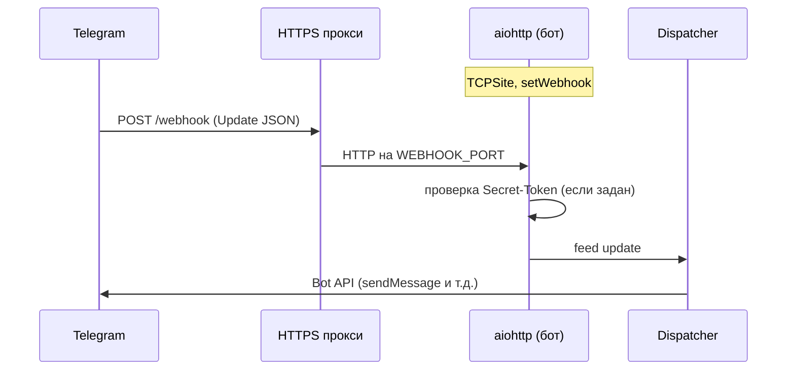

# Legal Consultation Bot

Telegram-бот для записи на юридические консультации. Ведёт пользователя по YAML-сценариям, собирает контакты и создаёт заявку в БД. Опционально — REST API (FastAPI) для CRM и исходящий webhook при новой заявке.

**Продакшен:** для Telegram рекомендуется **`TELEGRAM_USE_WEBHOOK=True`** — входящие обновления по HTTPS webhook (без long polling). Подробный разбор — в [алгоритме webhook](#алгоритм-работы-telegram-webhook).

## Оглавление

- [О проекте](#о-проекте)
- [Возможности](#возможности)
- [Алгоритм работы Telegram webhook](#алгоритм-работы-telegram-webhook)
- [OpenAPI и REST API](#openapi-и-rest-api)
- [Проверка работоспособности (health)](#проверка-работоспособности-health)
- [Быстрый старт](#быстрый-старт)
- [Медиа-файлы в сценариях](#медиа-файлы-в-сценариях)
- [Конфигурация (.env)](#конфигурация-env)
- [Миграции БД (Alembic)](#миграции-бд-alembic)
- [Бэкапы](#бэкапы)
- [Догоняющие напоминания (Followup)](#догоняющие-напоминания-followup)
- [Линтеры и форматирование](#линтеры-и-форматирование)
- [Тесты](#тесты)
- [Структура проекта](#структура-проекта)
- [CI, SAST и безопасность зависимостей](#ci-sast-и-безопасность-зависимостей)

## О проекте

Точка входа — `src/main.py`: инициализация БД, **ConversationManager**, мессенджеры (Telegram, опционально MAX), фоновые задачи (бэкапы, followup). При **`API_ENABLED=True`** в том же процессе поднимается **FastAPI** (интеграционный API и OpenAPI-документация на отдельном порту).

Режим **webhook**: внутри процесса бота поднимается **aiohttp**-приложение на `WEBHOOK_LISTEN_HOST` / `WEBHOOK_PORT`; после успешного `setWebhook` Telegram шлёт **POST** с JSON обновления на публичный URL. Режим **long polling** (локально): aiogram опрашивает Telegram без входящего HTTP.

## Возможности

- Telegram-бот (aiogram 3): **webhook (продакшен)** или long polling (локально) + опциональный MAX-мессенджер
- 16 юридических направлений + разветвлённые YAML-сценарии
- **Медиа-вложения** в сценариях: фото, кружочки (video_note), видео, GIF-анимации, стикеры
- Async SQLAlchemy (SQLite для разработки, PostgreSQL для продакшена)
- Alembic-миграции БД
- Автоматические бэкапы БД (local / FTP / S3)
- CI: Ruff + mypy + pytest; отдельные workflow — **CodeQL**, **pip-audit**, **Dependabot**
- Pre-commit хуки
- **Догоняющие напоминания** (followup) — 1ч, 12ч, 24ч, 72ч с авто-завершением
- **Удаление данных** клиентом через `/deletedata`
- **Валидация RU телефонов/email** (+7, 8, стационарные)
- **Возврат клиента** — пропуск контактов при повторном прохождении
- **Python 3.12+**, line-length 80
- **HTTP API** для CRM: заявки и пользователи (FastAPI), **Swagger UI** (`/docs`), **ReDoc** (`/redoc`), схема **OpenAPI 3** (`/openapi.json`)
- **Исходящий webhook** на ваш URL при новой заявке (опционально с Bearer-токеном)
- **Админ-команды** в Telegram: `/admin`, `/stats`, `/users`, `/export` (список `ADMIN_IDS`)
- **Liveness / readiness** для оркестраторов: на порту API и на порту webhook

## Алгоритм работы Telegram webhook

Ниже — логика, реализованная в `TelegramMessenger` (`src/messengers/telegram/telegram_messenger.py`) при **`TELEGRAM_USE_WEBHOOK=True`**.

### 1. Предусловия

- Публичный **HTTPS**-URL с валидным сертификатом (для тестов — например ngrok).
- В `.env` / `.env.local` заданы **`WEBHOOK_URL`** (полный или только origin) и при необходимости **`TELEGRAM_WEBHOOK_PATH`** (по умолчанию `/webhook`). Итоговый URL должен совпадать с тем, куда прокси (nginx и т.д.) передаёт POST от Telegram.
- Локальная привязка: **`WEBHOOK_LISTEN_HOST`**, **`WEBHOOK_PORT`**. Разрешённые порты для webhook со стороны Telegram: **443, 80, 88, 8443** ([документация Telegram](https://core.telegram.org/bots/webhooks)).
- Опционально **`TELEGRAM_WEBHOOK_SECRET`**: тот же секрет Telegram передаёт в заголовке `X-Telegram-Bot-Api-Secret-Token` (символы `A–Z`, `a–z`, `0–9`, `_`, `-`).

### 2. Запуск процесса

1. Собирается публичный URL вызовом **`build_telegram_webhook_url()`** (origin + путь, если путь не был в URL).
2. Создаётся **`aiohttp.web.Application`**.
3. Регистрируются служебные маршруты **`GET /health/live`** и **`GET /health/ready`** (см. [health](#проверка-работоспособности-health)).
4. **`SimpleRequestHandler`** (aiogram) вешается на путь webhook (например `/webhook`); при заданном секрете aiogram отклоняет запросы с неверным заголовком.
5. **`setup_application`** связывает приложение с **Dispatcher** и ботом.
6. Запускается **`AppRunner`** + **`TCPSite`** на `WEBHOOK_LISTEN_HOST:WEBHOOK_PORT`.
7. Вызывается **`set_webhook(url=…, secret_token=…, drop_pending_updates=…)`**. При ошибке runner останавливается, исключение пробрасывается.
8. Корутина webhook-режима **блокируется** на `asyncio.Event().wait()` — процесс остаётся живым и обрабатывает HTTP.

### 3. Обработка одного обновления

1. Telegram отправляет **POST** на ваш публичный URL с телом **Update** (JSON).
2. Прокси терминирует TLS и проксирует запрос на локальный порт приложения.
3. aiohttp передаёт запрос в **SimpleRequestHandler** → **Dispatcher** → ваши хендлеры (**ConversationManager** и др.).
4. Исходящие вызовы к Telegram API (ответ пользователю) идут **из вашего сервера** к `api.telegram.org` как обычно.

### 4. Остановка

При **`stop()`**: **`delete_webhook`**, затем **`AppRunner.cleanup()`**. В режиме long polling вместо этого закрывается сессия бота.

### 5. Сводная диаграмма



### 6. Параллельно с REST API

**`API_ENABLED=True`** поднимает FastAPI на **`API_HOST` / `API_PORT`** (отдельный HTTP-сервер). Webhook и API — **разные порты**; nginx может маршрутизировать, например, `/webhook` → webhook-порт, `/v1/` → API-порт.

### Long polling (разработка)

При **`TELEGRAM_USE_WEBHOOK=False`** входящий HTTP для Telegram не нужен; **`start_polling`** запрашивает обновления активно. Для локальной работы без HTTPS это проще.

## OpenAPI и REST API

**OpenAPI 3** — машиночитаемое описание HTTP API (пути, параметры, схемы JSON, коды ответов). По нему строятся **Swagger UI** и **ReDoc**, генерируются клиенты и тесты. В проекте схема отдаётся как **`GET /openapi.json`**; описание для человека дублируется в **`src/api/openapi_config.py`**.

### Интерактивная документация

После включения API (`API_ENABLED=True` или `python -m src.run_api`):

| URL | Описание |
|-----|----------|
| `http://<хост>:<порт>/docs` | **Swagger UI** — методы, схемы, **Authorize** |
| `http://<хост>:<порт>/redoc` | **ReDoc** |
| `http://<хост>:<порт>/openapi.json` | Спецификация OpenAPI 3 |

Корень **`GET /`** возвращает JSON со ссылками на документацию и пути **health**.

### Запуск

1. Зависимости: `fastapi`, `uvicorn` (в `requirements.txt`).
2. В `.env` / `.env.local`: **`API_ENABLED=True`**, при необходимости **`API_PORT`**, **`INTEGRATION_API_TOKEN`**.
3. **Бот + API:** `python -m src.main`.
4. **Только API:** `python -m src.run_api`.

### Авторизация

- Если **`INTEGRATION_API_TOKEN` задан** — заголовок **`Authorization: Bearer <токен>`** или **`X-API-Key: <токен>`**. В Swagger: **Authorize** → Bearer или ApiKey.
- Если токен пустой — проверка отключена (только изолированная сеть).

### Методы API

| Метод | Путь | Назначение |
|-------|------|------------|
| GET | `/v1/health` | Liveness (совместимость с прежним health, без БД) |
| GET | `/v1/health/live` | Liveness, без БД |
| GET | `/v1/health/ready` | Readiness, проверка БД; **503**, если БД недоступна |
| GET | `/v1/consultations/{id}` | Одна заявка и пользователь по id |
| GET | `/v1/consultations` | Поиск: query `phone`, `email`, `status` (нужен минимум один параметр; фильтры AND) |
| POST | `/v1/consultations/{id}/push` | Повторно отправить JSON заявки на `OUTBOUND_WEBHOOK_URL` |

Пример с токеном:

```bash
curl -s -H "Authorization: Bearer ВАШ_ТОКЕН" \
  "http://127.0.0.1:8080/v1/consultations?status=pending&limit=10"
```

### Исходящий webhook (бот → ваш сервер)

При завершении диалога с новой заявкой выполняется **POST** на **`OUTBOUND_WEBHOOK_URL`** (тело: `event`, `consultation`, `user`). Если задан **`OUTBOUND_WEBHOOK_TOKEN`**, добавляется **`Authorization: Bearer ...`**. Детали полей — в `/docs` и в `src/services/outbound_sync.py`.

## Проверка работоспособности (health)

Используются два уровня:

| Тип | Назначение | БД |
|-----|------------|-----|
| **Liveness** | Процесс и HTTP-стек отвечают | не проверяется |
| **Readiness** | Готовность принимать «боевую» нагрузку | лёгкий `SELECT 1` |

### Когда включён REST API (`API_ENABLED=True` или только `run_api`)

| Метод | Путь | Код при неготовности |
|-------|------|----------------------|
| GET | `/v1/health` | всегда 200 (liveness) |
| GET | `/v1/health/live` | всегда 200 |
| GET | `/v1/health/ready` | **503**, если БД недоступна |

### Режим только webhook (API выключен)

На **`WEBHOOK_PORT`** том же aiohttp-приложении, что и Telegram webhook:

| Метод | Путь |
|-------|------|
| GET | `/health/live` |
| GET | `/health/ready` |

Ответ readiness совпадает по смыслу с API (поля `status`, `ready`, `checks`, плюс `service: "telegram_webhook"`).

### Примеры для Kubernetes

```yaml
livenessProbe:
  httpGet:
    path: /v1/health/live
    port: 8080
  initialDelaySeconds: 10
  periodSeconds: 15
readinessProbe:
  httpGet:
    path: /v1/health/ready
    port: 8080
  initialDelaySeconds: 5
  periodSeconds: 10
```

Если в поде только бот с webhook и без API, замените **port** на порт webhook и пути на **`/health/live`** и **`/health/ready`**.

## Быстрый старт

### 1. Установка через Poetry (рекомендуется)

```bash
# Клонировать проект
git clone <repo-url> && cd legal_bot_app

# Установить зависимости
poetry install

# Скопировать конфиг
cp env.example .env.local

# Вписать токен бота (получить у @BotFather)
# В файле .env.local:
#   TELEGRAM_BOT_TOKEN=7123456789:AAxxxxxxxxxxxxxxxxxxxxxxx

# Запустить бота
poetry run python -m src.main

# Только HTTP API (без Telegram): нужны fastapi + uvicorn из requirements.txt
# poetry run python -m src.run_api
```

### 2. Установка через pip

```bash
python -m venv .venv
source .venv/bin/activate   # Linux/Mac
# .venv\Scripts\activate    # Windows

pip install -r requirements.txt
cp env.example .env.local
# Заполнить TELEGRAM_BOT_TOKEN в .env.local

python -m src.main

# Только интеграционный API (Swagger: http://localhost:8080/docs)
# python -m src.run_api
```

### 3. Запуск через Docker

```bash
# Скопировать конфиг
cp env.example .env.local
# Заполнить TELEGRAM_BOT_TOKEN в .env.local

# Собрать и запустить (бот + PostgreSQL)
docker compose up --build -d

# Посмотреть логи
docker compose logs -f bot

# Остановить
docker compose down
```

Docker Compose поднимает:

- **postgres** — PostgreSQL 15 (данные в Docker volume)
- **bot** — приложение (автоматически подключается к postgres)

## Медиа-файлы в сценариях

Медиа хранятся в `src/scenarios/media/`. Поддерживаются:

| Тип | Ключ | Расширения | Описание |
|---|---|---|---|
| Фотографии | `photo` | jpg, png, webp | Обычное фото с подписью |
| Кружочки | `video_note` | mp4 | Круглое видео (Telegram video note) |
| Видео | `video` | mp4, mov | Обычное видео с подписью |
| GIF | `animation` | gif, mp4 | Анимация |
| Стикеры | `sticker` | webp, tgs | Стикеры |

### Пример YAML-сценария с медиа

```yaml
steps:
  - id: "greeting"
    type: "text"
    content: "Добро пожаловать!"
    media:
      - type: "photo"
        file: "src/scenarios/media/welcome.jpg"
        caption: "Наша команда юристов"
      - type: "video_note"
        file: "src/scenarios/media/greeting_circle.mp4"
```

Каждый шаг может содержать несколько медиа-вложений. Они отправляются перед текстом шага.

Legacy-поле `photo` (на уровне шага) по-прежнему поддерживается для обратной совместимости.

## Конфигурация (.env)

Приложение загружает `.env`, затем `.env.local` с приоритетом. Для локальной разработки используйте `.env.local` (он в `.gitignore`).

| Переменная | По умолчанию | Описание |
|---|---|---|
| `TELEGRAM_BOT_TOKEN` | — | Токен от @BotFather |
| `TELEGRAM_USE_WEBHOOK` | `False` | `True` — только webhook (продакшен) |
| `WEBHOOK_URL` | — | Публичный `https://…` для `setWebhook` |
| `WEBHOOK_LISTEN_HOST` | `0.0.0.0` | Привязка локального HTTP под webhook |
| `WEBHOOK_PORT` | `8443` | Порт (из разрешённых Telegram: 443, 80, 88, 8443) |
| `TELEGRAM_WEBHOOK_PATH` | `/webhook` | Путь, если в `WEBHOOK_URL` нет пути |
| `TELEGRAM_WEBHOOK_SECRET` | — | Секрет заголовка от Telegram (рекомендуется) |
| `TELEGRAM_WEBHOOK_DROP_PENDING` | `False` | Сбрасывать очередь updates при set/delete webhook |
| `MAX_BOT_TOKEN` | — | Токен MAX (опционально) |
| `DATABASE_URL` | `sqlite+aiosqlite:///./legal_bot.db` | URL базы данных |
| `DEBUG` | `False` | Режим отладки |
| `LOG_LEVEL` | `INFO` | Уровень логирования |
| `BACKUP_ENABLED` | `False` | Включить авто-бэкапы |
| `BACKUP_STORAGE_TYPE` | `local` | `local` / `ftp` / `s3` |
| `BACKUP_INTERVAL_HOURS` | `1` | Интервал бэкапов (часы) |
| `BACKUP_RETENTION_DAYS` | `30` | Хранить бэкапы (дни) |
| `FOLLOWUP_ENABLED` | `False` | Включить догоняющие напоминания |
| `FOLLOWUP_CHECK_INTERVAL_MIN` | `10` | Как часто проверять (минуты) |
| `FOLLOWUP_INTERVALS_HOURS` | `[1, 12, 24, 72]` | Через сколько часов напоминать (JSON) |
| `FOLLOWUP_MESSAGES` | встроенные | Тексты напоминаний (JSON-массив строк) |
| `ADMIN_IDS` | — | Telegram user id админов через запятую |
| `API_ENABLED` | `False` | Поднять REST API вместе с ботом (`src.main`) |
| `API_HOST` | `0.0.0.0` | Адрес прослушивания API |
| `API_PORT` | `8080` | Порт API |
| `INTEGRATION_API_TOKEN` | — | Токен для внешних запросов (пусто = без проверки) |
| `OUTBOUND_WEBHOOK_URL` | — | URL для POST при новой заявке |
| `OUTBOUND_WEBHOOK_TOKEN` | — | Bearer к внешнему webhook (можно пусто) |

Полный список переменных: `env.example`

## Миграции БД (Alembic)

Миграции читают `DATABASE_URL` из `.env` / `.env.local`.

```bash
# Применить все миграции
alembic upgrade head

# Создать новую миграцию после изменения моделей
alembic revision --autogenerate -m "описание изменений"

# Откатить на одну миграцию назад
alembic downgrade -1

# Посмотреть текущую ревизию
alembic current

# История миграций
alembic history
```

### Миграции в Docker

```bash
docker compose exec bot alembic upgrade head
docker compose exec bot alembic revision --autogenerate -m "add new field"
```

## Бэкапы

Настраиваются в `.env`. Поддерживаются три типа хранилищ:

### Локальный

```env
BACKUP_ENABLED=True
BACKUP_STORAGE_TYPE=local
BACKUP_LOCAL_PATH=./backups
```

### FTP / FTPS

```env
BACKUP_STORAGE_TYPE=ftp
BACKUP_FTP_HOST=ftp.example.com
BACKUP_FTP_PORT=21
BACKUP_FTP_USER=user
BACKUP_FTP_PASSWORD=secret
BACKUP_FTP_PATH=/backups
BACKUP_FTP_TLS=True
```

### S3 (AWS / MinIO / Yandex Object Storage)

```bash
pip install boto3  # дополнительная зависимость
```

```env
BACKUP_STORAGE_TYPE=s3
BACKUP_S3_ENDPOINT=https://storage.yandexcloud.net
BACKUP_S3_BUCKET=my-backups
BACKUP_S3_ACCESS_KEY=...
BACKUP_S3_SECRET_KEY=...
BACKUP_S3_REGION=ru-central1
BACKUP_S3_PREFIX=backups
```

## Догоняющие напоминания (Followup)

Фоновый сервис периодически проверяет неактивные чаты и отправляет напоминания клиентам, которые не завершили консультацию:

| Интервал | Действие |
|---|---|
| 1 час | Первое напоминание |
| 12 часов | Второе напоминание |
| 24 часа | Третье напоминание |
| 72 часа (3 дня) | Последнее напоминание |
| > 72 часов | Чат автоматически завершается |

Интервалы и тексты настраиваются через `.env`:

```env
FOLLOWUP_ENABLED=True
FOLLOWUP_CHECK_INTERVAL_MIN=10
FOLLOWUP_INTERVALS_HOURS=[1, 12, 24, 72]
# FOLLOWUP_MESSAGES=["Текст 1","Текст 2","Текст 3","Текст 4"]
```

### Возврат завершённого клиента

Если клиент, который ранее завершил консультацию, снова пишет `/start`, бот проводит его по сценарию заново, но **пропускает этап сбора контактов** (имя, телефон уже есть в БД).

### Удаление данных

Команда `/deletedata` запускает процедуру удаления персональных данных:

1. Бот запрашивает подтверждение
2. При ответе «Да, удалить» — полностью удаляет пользователя, чаты, шаги, консультации из БД
3. При любом другом ответе — отмена

### Валидация контактов (RU)

Телефон проверяется на соответствие форматам РФ:

- Мобильные: `+7XXXXXXXXXX`, `8XXXXXXXXXX`
- С пробелами/скобками: `+7 (999) 123-45-67`
- Стационарные: `8(495)1234567`
- 10 цифр без кода: `9991234567`

Email проверяется стандартным регулярным выражением.

## Линтеры и форматирование

Проект использует **Ruff** (линтер + форматтер, line-length=80) и **mypy** (проверка типов).

### Ручной запуск

```bash
# Форматирование (аналог black + isort)
ruff format src/ tests/

# Линтинг с автофиксом
ruff check src/ tests/ --fix

# Только проверка (без изменений)
ruff check src/ tests/
ruff format --check src/ tests/

# Проверка типов
mypy src/ --config-file pyproject.toml
```

### Pre-commit хуки (автопроверка при git commit)

```bash
# Установить хуки (один раз)
pip install pre-commit
pre-commit install

# Теперь при каждом git commit автоматически:
# 1. ruff format — форматирование
# 2. ruff check  — линтинг
# 3. mypy        — проверка типов
# 4. trailing-whitespace, end-of-file-fixer, check-yaml, detect-private-key

# Ручной запуск на всех файлах
pre-commit run --all-files
```

## Тесты

Тесты работают на **отдельной in-memory SQLite БД** — продакшен-данные не затрагиваются.

```bash
# Установить зависимости для тестов
pip install pytest pytest-asyncio

# Запустить все тесты
pytest tests/ -v

# Запустить конкретный файл
pytest tests/test_database.py -v

# С покрытием (нужен pytest-cov)
pytest tests/ --cov=src --cov-report=term-missing
```

### Структура тестов

| Файл | Что тестирует |
|---|---|
| `test_database.py` | ORM-модели (CRUD на тестовой SQLite) |
| `test_consultation_service.py` | ConsultationService (бизнес-логика БД) |
| `test_conversation_manager.py` | Менеджер диалогов (парсинг контактов, routing, медиа, удаление данных, skip contacts) |
| `test_backup_service.py` | BackupService (создание/очистка бэкапов, парсинг URL) |
| `test_algorithm_engine.py` | Движок алгоритмов + YAML загрузчик + медиа-вложения |
| `test_followup_service.py` | Сервис напоминаний (интервалы, отправка, авто-завершение) |
| `test_validators.py` | Валидация RU телефонов и email |

## Структура проекта

```
legal_bot_app/
├── .env                      # Основной конфиг (gitignored)
├── .env.local                # Локальные переопределения (gitignored)
├── env.example               # Шаблон конфига
├── docker-compose.yml        # Docker: бот + PostgreSQL
├── Dockerfile
├── pyproject.toml            # Poetry + Ruff + mypy + pytest
├── requirements.txt
├── alembic.ini               # Конфиг Alembic
├── alembic/
│   ├── env.py                # Async миграции + .env
│   ├── script.py.mako
│   └── versions/             # Файлы миграций
├── .pre-commit-config.yaml
├── .github/
│   ├── dependabot.yml        # Обновления pip + GitHub Actions
│   └── workflows/
│       ├── lint.yml          # CI: Ruff + mypy + pytest
│       ├── security.yml      # pip-audit по requirements.txt
│       └── codeql.yml        # CodeQL (SAST) для Python
├── src/
│   ├── main.py               # Точка входа (бот + опционально API)
│   ├── run_api.py            # Только HTTP API
│   ├── api/                  # FastAPI: маршруты, схемы, OpenAPI/Swagger
│   ├── config/
│   │   ├── settings.py       # Все настройки из .env
│   │   └── logging_config.py
│   ├── core/
│   │   ├── algorithm_engine.py  # Step, Algorithm, MediaAttachment
│   │   ├── conversation_manager.py
│   │   └── validators.py        # RU phone/email validation
│   ├── database/
│   │   ├── base.py           # Async engine + Base
│   │   └── models/           # ORM-модели
│   ├── messengers/
│   │   ├── base/             # AbstractMessenger, MediaItem
│   │   ├── telegram/         # Aiogram 3
│   │   └── max/              # MAX (опционально)
│   ├── services/
│   │   ├── consultation_service.py
│   │   ├── admin_service.py     # Статистика для /admin в Telegram
│   │   ├── outbound_sync.py     # POST заявок на внешний webhook
│   │   ├── health_service.py    # Проверки readiness (БД)
│   │   ├── backup_service.py
│   │   └── followup_service.py  # Догоняющие напоминания
│   └── scenarios/
│       ├── algorithms/       # YAML-сценарии
│       ├── assets/           # Статические изображения (welcome.jpg)
│       └── media/            # Медиа-файлы (фото, кружочки, видео, GIF)
└── tests/                    # Unit-тесты
```

## CI, SAST и безопасность зависимостей

После пуша репозитория на **GitHub** включите при необходимости вкладку **Security** → **Code security and analysis** и разрешите **Code scanning**, **Dependabot alerts**, **Supply chain** — иначе часть отчётов будет недоступна.

### Непрерывная интеграция (код и тесты)

Файл **`.github/workflows/lint.yml`**: на push/PR в ветки `master`, `dev`, `release` запускаются **Ruff** (формат + линт), **mypy**, **pytest** (in-memory SQLite).

### Dependabot (актуальность зависимостей)

Файл **`.github/dependabot.yml`**: еженедельные PR с обновлениями **pip** (`/` — корень репозитория, ориентир `requirements.txt` / манифесты в корне) и **github-actions**. Это снижает риск устаревших пакетов с известными исправлениями.

### Аудит уязвимостей в зависимостях (pip-audit)

Файл **`.github/workflows/security.yml`**: устанавливаются зависимости из **`requirements.txt`**, затем **`pip-audit`** сравнивает дерево пакетов с базами уязвимостей (по умолчанию PyPI/OSV). Workflow срабатывает на push/PR в те же ветки и по расписанию (раз в неделю).

Локально:

```bash
pip install pip-audit
pip-audit -r requirements.txt
```

Проект на **Poetry**: для CI зафиксирован **`requirements.txt`**; при изменении зависимостей через Poetry обновляйте экспорт в `requirements.txt`, если он используется в Docker/CI.

### CodeQL (статический анализ кода, SAST)

Файл **`.github/workflows/codeql.yml`**: **GitHub CodeQL** для языка **Python** — поиск типичных ошибок и небезопасных шаблонов в исходниках (не путать с аудитом версий пакетов). Запуск: push/PR и еженедельное расписание. Результаты — в **Security** → **Code scanning alerts**.
